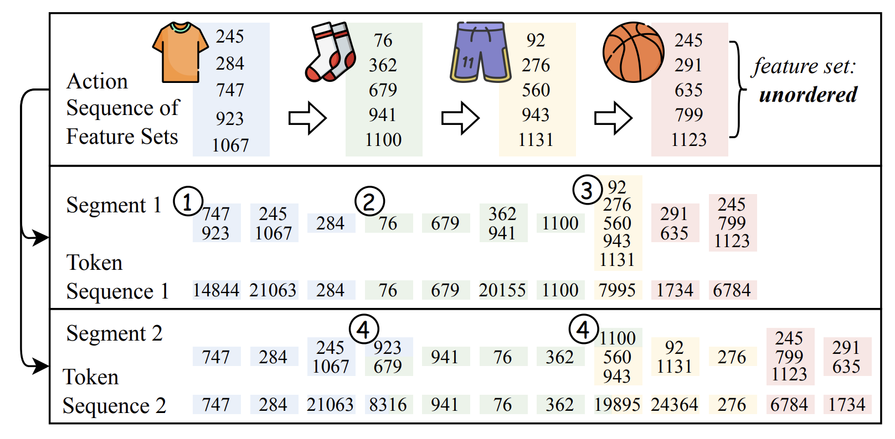

# ActionPiece: Contextual Action Tokenization

This repository provides the code for implementing ActionPiece described in our
**ICML 25 Spotlight** paper "[Contextually Tokenizing Action Sequences forGenerative Recommendation](https://arxiv.org/abs/2502.13581)".

Unlike existing generative recommendation (GR) models that tokenize each action
independently, we propose ActionPiece, a method that
**explicitly incorporates context into action sequence tokenization**.
In ActionPiece, each action is initially represented as a set of item features.
Using a corpus of action sequences, we construct a vocabulary by merging
frequently co-occurring feature patterns, both within individual sets and across
adjacent sets.

<div  align="center">

</div>

## Quick start

```bash
CUDA_VISIBLE_DEVICES=0 python main.py \
    --category=Sports_and_Outdoors
```

Note that:
1. The datasets will be automatically downloaded once the `category` argument is specified.
2. All hyperparameters can be specified via command line arguments. Please refer to:
    * `genrec/default.yaml`
    * `genrec/datasets/AmazonReviews2014/config.yaml`
    * `genrec/models/ActionPiece/config.yaml`

## Reproduction

### Sports and Outdoors

Below are the scripts to reproduce the results reported in our paper.

```bash
for seed in {2024..2028}; do
    CUDA_VISIBLE_DEVICES=0 python main.py \
        --category=Sports_and_Outdoors \
        --rand_seed=${seed} \
        --weight_decay=0.15 \
        --lr=0.005 \
        --n_hash_buckets=128
done
```

### Beauty

```bash
for seed in {2024..2028}; do
    CUDA_VISIBLE_DEVICES=0 python main.py \
        --category=Beauty \
        --rand_seed=${seed} \
        --weight_decay=0.15 \
        --lr=0.001 \
        --n_hash_buckets=64
done
```

### CDs and Vinyl

```bash
for seed in {2024..2028}; do
    CUDA_VISIBLE_DEVICES=0 python main.py \
        --category=CDs_and_Vinyl \
        --rand_seed=${seed} \
        --weight_decay=0.07 \
        --lr=0.001 \
        --d_model=256 \
        --d_ff=2048 \
        --n_hash_buckets=256
done
```

## Locating the code

### Vocabulary construction

* `genrec/models/ActionPiece/core.py` - `ActionPieceCore.train()`

### Segmentation

Set permutation regularization (SPR) during

* **training**: `genrec/models/ActionPiece/tokenizer.py` - `ActionPieceTokenizer.collate_fn_train()`
* **inference**:
    * `genrec/models/ActionPiece/tokenizer.py` - `ActionPieceTokenizer.collate_fn_test()`
    * `genrec/models/ActionPiece/model.py` - `ActionPiece.generate()`

## Tokenizers

After the first run on each dataset, the provided code automatically constructs
and caches the tokenizer vocabulary. The cached tokenizer follows a structure
like:

```json
{
    "n_categories": 5,
    "n_init_feats": 1153,
    "token2feat": [
        [-1, -1], # placeholder
        [0, 0], [0, 1], ...,
        [1, 0], [1, 1], ...,
        [4, 126], [4, 127], # [a, b] denotes the b-th choice of each item's a-th feature
        [-1, 363, 763], [-1, 269, 515], ...,
[-1, 241, 1040], [-1, 30314, 39998] # [-1, u, v] denotes token u and v are merged into a new token
    ],
    "priority": [
        0, 0, ...,
        723.6, 670.04, ...
    ]
}
```

## Citing this work

Please cite the following paper if you find our code, processed datasets, or
tokenizers helpful.

```
@inproceedings{hou2025actionpiece,
  title={{ActionPiece}: Contextually Tokenizing Action Sequences for Generative Recommendation},
  author={Yupeng Hou and Jianmo Ni and Zhankui He and Noveen Sachdeva and Wang-Cheng Kang and Ed H. Chi and Julian McAuley and Derek Zhiyuan Cheng},
  booktitle={{ICML}},
  year={2025}
}
```

## License and disclaimer

Copyright 2025 Google LLC

All software is licensed under the Apache License, Version 2.0 (Apache 2.0);
you may not use this file except in compliance with the Apache 2.0 license.
You may obtain a copy of the Apache 2.0 license at:
https://www.apache.org/licenses/LICENSE-2.0

All other materials are licensed under the Creative Commons Attribution 4.0
International License (CC-BY). You may obtain a copy of the CC-BY license at:
https://creativecommons.org/licenses/by/4.0/legalcode

Unless required by applicable law or agreed to in writing, all software and
materials distributed here under the Apache 2.0 or CC-BY licenses are
distributed on an "AS IS" BASIS, WITHOUT WARRANTIES OR CONDITIONS OF ANY KIND,
either express or implied. See the licenses for the specific language governing
permissions and limitations under those licenses.

This is not an official Google product.
